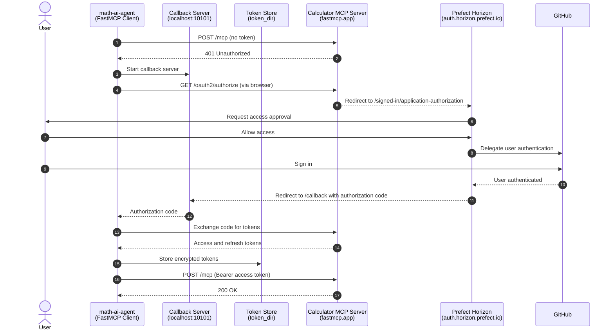

## OAuth Authentication Flow

This project's source code and documentation were generated with the
assistance of Artificial Intelligence (AI). For more information, please
refer to the `AI_DISCLAIMER.md` document located in the project's root
directory.

